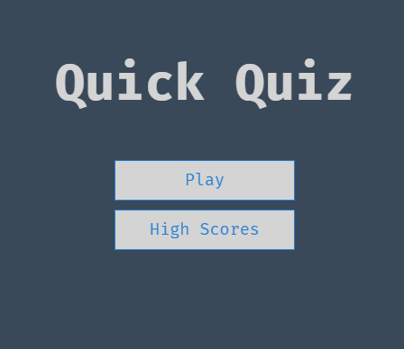

# Create a Quiz App with HTML, CSS, and JavaScript

***
To Test the project directly use the link bellow :
  * https://said-bachar.github.io/Quiz-App-/ 
***
Build a Quiz App with HTML, CSS, and JavaScript to improve your Core Web Dev.

Want to improve your **core Web Dev skills**? Want to improve your knowledge of **HTML, CSS, and JavaScript**? In this simple project, you're going to learn how to build a Quiz application **without the assistance of libraries or frameworks**. Here are some of the topic we will cover!

-   Save high scores in Local Storage
-   Create a progress bar
-   Create a spinning loader icon
-   Dynamically generate HTML in JavaScript
-   Fetch trivia questions from Open Trivia DB API

-   JavaScript - Array Functions (splice, map, sort), Local Storage, Fetch API
-   ES6 JavaScript Features - Arrow Functions, the Spread Operator, Const and Let, Template Literals
-   CSS - Flexbox, Animtations, and REM units

## Course Intro and Resources

Welcome to "Quiz App with Pure HTML, CSS, and JS". 

In this Project, i'm going to use fundamental HTML, CSS, and JavaScript skills to build a quiz application. This application will be able to load questions from a 3rd party API, track and display high scores, and so much more! You'll learn how to use Local Storage, create animations, use modern ES6 JavaScript features, and more.

## 0. Install Python and Launch Server 
Install python 3
Note: add python to the env PATH during installation.

git clone repo from git ( if is the case)

Open cmd aka command line
RUN: python -m http.server

Open index.html and start learning. 

## 1. Create and Style the Home Page

In this Part, I created the home page along with a good chunk of the necessary CSS. The home page will consist of a few links for the Game and High Scores pages. We will also create helper CSS classes for Flexbox, buttons, and hiding elements.
I encourage you all to take a look at Emmet snippets for generating HTML and CSS.

## 2. Create and Style the Game Page

In this Part, I created the Game Page and display static question and answer information. Eventually, we will load questions from an API, but for now, we will hard code one question so to establish styling.

## 3. Display Hard Coded Question and Answers

In this Part, i loaded questions from a hard coded array and iterate through available questions as the use answers them. We will use custom data attributes, the ES6 spread operator, and JavaScript arrow functions.

Resources

-   [Creating Code Snippets in Visual Studio Code](https://www.youtube.com/watch?v=K3gLlZm-m_8)
-   [Using Data Attributes](https://developer.mozilla.org/en-US/docs/Learn/HTML/Howto/Use_data_attributes)
-   [Document Query Selector](https://developer.mozilla.org/en-US/docs/Web/API/Document_object_model/Locating_DOM_elements_using_selectors)
-   [Document Get by ID](https://developer.mozilla.org/en-US/docs/Web/API/Document/getElementById)
-   [Spread Operator](https://developer.mozilla.org/en-US/docs/Web/JavaScript/Reference/Operators/Spread_syntax)
-   [Arrow Functions](https://developer.mozilla.org/en-US/docs/Web/JavaScript/Reference/Functions/Arrow_functions)

## 4. Display Feedback for Correct/Incorrect Answers

In this Part, we checked the user's answer for correctness and display feedback to the user before loading the next question.

Resources

-   [Bootstrap 4 Colors](https://www.w3schools.com/bootstrap4/bootstrap_colors.asp)
-   [Triple vs Double Equals](https://codeburst.io/javascript-double-equals-vs-triple-equals-61d4ce5a121a)

## 5. Create a HUD (Head's Up Display)

In this Part, I created a Heads Up Display (HUD) for our quiz app. This will display the user's score and current question number.

Resources

-   [ES6 Template Literals](https://developer.mozilla.org/en-US/docs/Web/JavaScript/Reference/Template_literals)

## 6. Create a Progress Bar

In this Part, we take our HUD one step further by creating a visual progress bar to track the user's progress through the questions.

## 7. Create and Style the End Page

In this Part, we will create our End page where we will display the user's achieved score. This screen will provide a form for saving the score and links for playing again or going home.

Resources

-   [Local Storage](https://www.w3schools.com/jsref/prop_win_localstorage.asp)

## 8. Save High Scores in Local Storage

In this Part, we save and maintain a high scores array in Local Storage. To do this, we will need to JSON.stringify() and JSON.parse() to convert our high score array to a string and visa versa.

Resources

-   [Local Storage](https://www.w3schools.com/jsref/prop_win_localstorage.asp)

## 9. Load and Display High Scores from Local Storage

In this Part, we will create our High Scores page. We will have to load the high scores from Local Storage, iterate through them, and display them on the screen.

Resources

-   [JSON Parse and Stringify](https://alligator.io/js/json-parse-stringify/)
-   [Array Sort](https://www.w3schools.com/js/js_array_sort.asp)
-   [Array Map](https://www.w3schools.com/jsref/jsref_map.asp)
-   [Array Join](https://developer.mozilla.org/en-US/docs/Web/JavaScript/Reference/Global_Objects/Array/join)

## 10. Fetch API to Load Questions From Local JSON File

In this Part, we move our sample questions from a hard coded array to an external .json file.

Resources

-   [How to Use the Fetch API](https://scotch.io/tutorials/how-to-use-the-javascript-fetch-api-to-get-data)
-   [Promises](https://developer.mozilla.org/en-US/docs/Web/JavaScript/Reference/Global_Objects/Promise_)

## 11. Fetch API to Load Questions from Open Trivia API

In this Part, we use Fetch to request a list of questions from the Open Trivia DB API.

Reources

-   [How to Use the Fetch API](https://scotch.io/tutorials/how-to-use-the-javascript-fetch-api-to-get-data)
-   [Open Trivia DB](https://opentdb.com/)
-   [Array Map](https://www.w3schools.com/jsref/jsref_map.asp)
-   [Array For Each](https://www.w3schools.com/jsref/jsref_foreach.asp)

## 12. Create a Spinning Loader

In this Final Part, we create a simple spinning loader in CSS that will be displayed until we are finished requesting/loading questions from the API.

Resources

-   [Create a CSS Loader](https://www.w3schools.com/howto/howto_css_loader.asp)

## 13. Closing

Thank you so much for reading this Project. I truly hope that you enjoyed it and that you have improved your core Web Dev skills!!.

Any advice or comment please..

- NEW FLOW 
Landing
   │
   └── Começar Agora
           │
           ├── Utilizador autenticado
           │       ↓
           │    Menu (Disciplinas)
           │
           └── Utilizador não autenticado
                   ↓
                 Login
                   ↓
                Menu

a
    

    -- Users table for authentication with simple username/password
create table users (
    id uuid primary key default gen_random_uuid(),
    username text unique not null,
    password text not null,
    created_at timestamp default now()
);

-- Enable RLS (Row Level Security)
alter table users enable row level security;

-- Create policy to allow anonymous users to read users table for login
create policy "Allow public read access for login"
on users for select
using (true);

-- Create policy to allow anonymous users to insert new users for registration
create policy "Allow public insert for registration"
on users for insert
with check (true);

insert into users (username, password)
 values ( 'admin','1234');

 select * from users;

 alter table users enable row level security;
alter table scores enable row level security;

create policy "public users select"
on users
for select
using (true);

create policy "public users insert"
on users
for insert
with check (true);

create policy "public scores select"
on scores
for select
using (true);

create policy "public scores insert"
on scores
for insert
with check (true);

select * from users;
select * from scores;
select * from profiles;

select * from users;
insert into scores ( username ,subject, difficulty, score, total_questions)
 values ( 'toto','Matemática 6 ano' ,'easy',17,10);

update users
set email = 'joao@bigodes.pt' where email is null;
 ALTER TABLE users
ADD COLUMN email text;

 ALTER TABLE scores
ADD COLUMN profile_id uuid;

ALTER TABLE scores
ADD CONSTRAINT scores_profile_id_fkey
FOREIGN KEY (profile_id)
REFERENCES profiles(id)
ON DELETE CASCADE;

update scores
set profile_id = 1
where username = 'toto';

drop table  users ;

create table public.users (
  id uuid primary key references auth.users(id),
  username text unique not null,
  email text,
  created_at timestamp default now()
);

delete from scores where username = 'toto';

alter table scores
alter column profile_id set not null;

insert into scores
(
    username,
    subject,
    difficulty,
    score,
    total_questions
)
values
(
    'Toto',
    'Economia 12',
    'medium',
    80,
    10
);

select * from users;
select * from auth.users;
alter table auth.users 
add COLUMN username text;
select 
*
from scores;
ALTER TABLE scores
ADD COLUMN email text;
DELETE FROM SCORES WHERE SCORE >0 ;
CREATE POLICY "Users can insert own profile"
ON users
FOR INSERT
TO authenticated
WITH CHECK (auth.uid() = id);